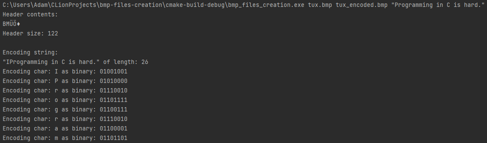
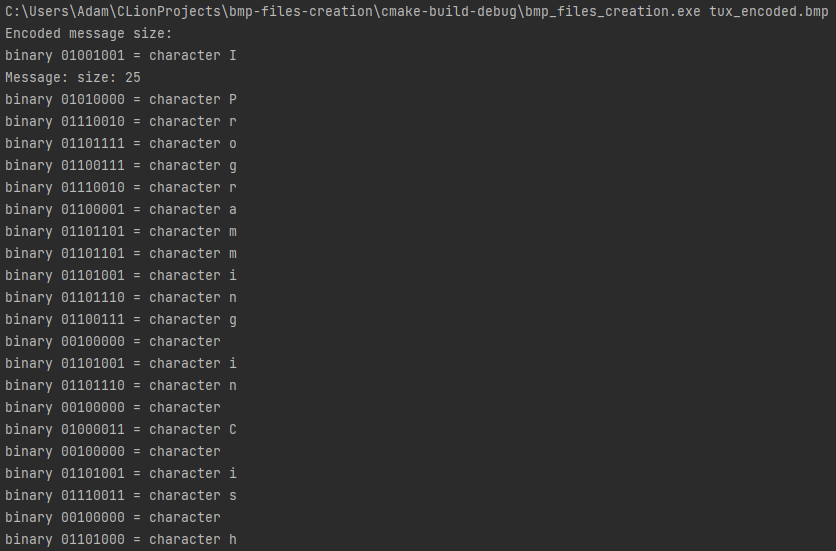

# bmp-steganography

course: Computer architecture with low-level programming

[Project description](https://www.cs.put.poznan.pl/tzok/public/cawllp-03-bmp.html)

**Only supports `BM` header BMP-files**

## Running with project arguments

### Encoding

`[input_filename.bmp] [output_filename.bmp] "[message]"`

example: `tux.bmp tux_encoded.bmp "Programming in C is hard."`

The visuals of image _tux.bmp_ does not change.

### Decoding

`[input_filename.bmp]`

example: `tux_encoded.bmp`

